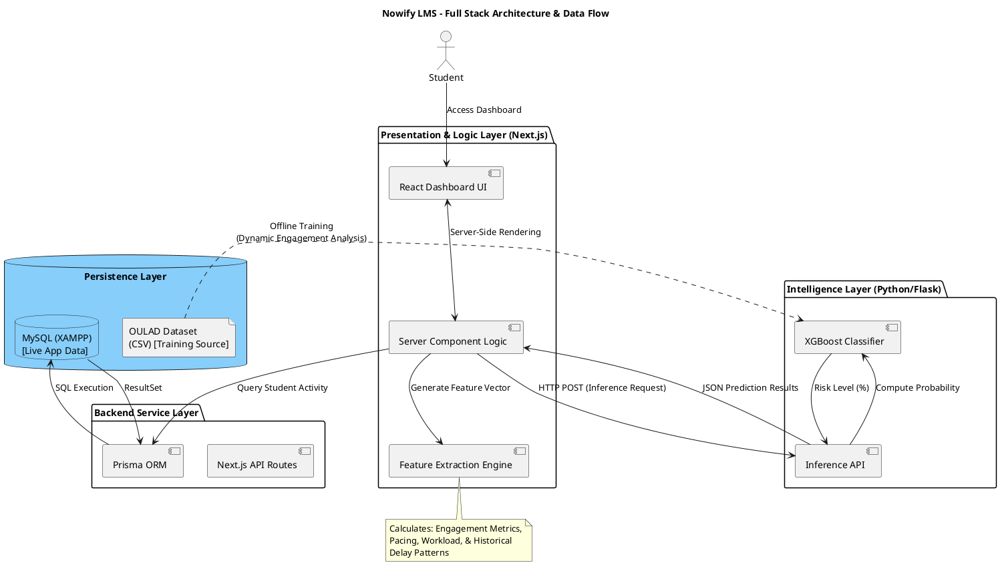

# Project-2 Presentation-1 (493 CCS-3)
## Nowify LMS: Intelligent System for Academic Performance & Procrastination Analysis

---

### 1. Design Phase Completion
The design phase of the **Nowify LMS** has been successfully concluded. This phase established the blueprint for a data-driven educational tool designed to mitigate procrastination through predictive analytics.
*   **Architectural Strategy:** Adoption of a decoupled Microservices-style architecture, separating the high-performance Next.js web interface from the Python-based Machine Learning inference engine.
*   **Data Modeling:** Implementation of a 3rd Normal Form (3NF) relational schema using Prisma and MySQL, ensuring data integrity across student profiles, academic records, and behavioral logs.
*   **Predictive Framework:** Design of a feature engineering pipeline that translates raw interaction data from the OULAD dataset into actionable behavioral features.
*   **User-Centric UI:** Design of a responsive, accessibility-focused dashboard using Tailwind CSS to facilitate seamless student engagement.

---

### 2. System Architecture & Module Structure (75% Complete)

#### **2.1 System Architecture Diagram (PlantUML)**

#### **2.2 Core Module Structures**
*   **Dynamic Data Pipeline:** The `app/dashboard` utilizes `lib/featureVector.ts` to perform real-time extraction of engagement metrics. This ensures the ML model receives current behavioral data for every request.
*   **Resilient Design:** Integrated a **Heuristic Fallback Engine** that provides logic-based risk assessment in the event the Python ML service is offline, ensuring 100% dashboard availability.
*   **ML Pipeline (`ml/`):** Implements a robust training strategy using standard OULAD features to predict academic procrastination outcomes based on student engagement patterns and historical submission behavior.

---

### 3. Data Dictionary (Database & Intelligence)

#### **3.1 Database Table Definitions**
| Entity | Field | Type | Description |
| :--- | :--- | :--- | :--- |
| **Student** | `university_id` | String | Unique student identifier used for system authentication. |
| | `data_consent_at` | DateTime | Timestamp of student consent for ML data processing. |
| **Course** | `enrolled_at` | DateTime | The date the student registered for the course. |
| | `course_start_date`| DateTime | Official start of the academic period. |
| **Assignment** | `due_date` | DateTime | Target submission deadline for course assessments. |
| **LmsActivity**| `login_count` | Int | Total cumulative logins for the student. |
| | `last_login_date` | DateTime | Most recent system access timestamp. |

#### **3.2 Machine Learning Feature Matrix (Full)**

The following 8 optimized features constitute the input vector for the procrastination prediction model, derived from student interaction logs and academic records:

| # | Feature Name | Source | Description |
| :--- | :--- | :--- | :--- |
| 1 | `previous_delays_count` | Assessments | Frequency of past assignments submitted after the official deadline. |
| 2 | `assignments_count` | Courses | Total volume of assessment items assigned across all enrolled modules. |
| 3 | `activity_count_in_enrolled_courses` | LmsActivity | Total volume of student interactions within course modules. |
| 4 | `courses_count` | Student Info | Number of unique courses the student is registered for in the current period. |
| 5 | `workload_level` | Enrollment | Normalized burden score based on total credits and overlapping deadlines. |
| 6 | `non_submission_count` | Assessments | Total count of missed deadlines where no submission occurred. |
| 7 | `last7d_engagement` | LmsActivity | VLE interaction intensity recorded over the most recent 7-day window. |
| 8 | `course_engagement` | LmsActivity | Student's participation level relative to the course average engagement. |

---

### 4. Implemented Environment, Tools & Verification (Guideline 3)

#### **4.1 Implementation Environment & Stack**

*   **Front End Technologies:**
    *   **Next.js 14:** Utilized for Server-Side Rendering (SSR) and Client-Side Navigation.
    *   **React 18:** Functional components and Hooks for building modular UI elements.
    *   **Tailwind CSS:** Used for rapid UI development and responsive design.
    *   **TypeScript:** Enforces static typing for improved codebase maintainability.

*   **Backend & Database Technologies:**
    *   **Next.js API Routes:** Serverless endpoints for business logic orchestration.
    *   **Prisma ORM:** Provides a type-safe database client for MySQL.
    *   **MySQL (XAMPP):** Relational database for persistent storage.
    *   **Bcrypt.js:** Library for secure password hashing.

*   **Machine Learning Ecosystem:**
    *   **Python 3.10:** Core language for the ML pipeline and inference API.
    *   **XGBoost Classifier:** High-performance model for tabular behavioral data.
    *   **Flask:** Lightweight framework used to expose the model as a microservice.
    *   **Scikit-learn:** Utilized for scaling, preprocessing, and benchmarking.

#### **4.2 Hardware Infrastructure**
*   **Infrastructure:** Quad-core CPU with 16GB RAM is utilized for concurrent execution of the Next.js server, Flask API, and MySQL database.
*   **Platform Independence:** The application is a responsive web solution, ensuring compatibility across Windows, macOS, and Linux.

---

### 5. User Interface & Integration of User Needs (Guideline 4)

#### **5.1 Functional Requirements Integrated into UI**
*   **FR1: Secure Authentication:** Session persistence using University IDs.
*   **FR2: Ethical AI Consent:** Transparent data-sharing agreement module.
*   **FR3: Intelligent Dashboard:** Real-time XGBoost-driven risk visualization.
*   **FR4: Integrated Task Board:** Centralized hub for personal and course deadlines.

#### **5.2 Addressing User Needs through Design**
*   **Understanding Student Needs:** Requirements gathering identified "deadline anxiety" and "lack of progress visibility" as key student pain points.
*   **Design Integration:**
    *   **Cognitive Load Reduction:** The UI prioritizes urgent tasks using color-coded alerts to prompt immediate action.
    *   **Proactive Intervention:** The "Procrastination Level" bar provides a behavioral nudge for objective self-assessment.

---

### 6. Machine Learning Evaluation (Guideline 5)

The machine learning core of Nowify LMS was subjected to rigorous evaluation using the OULAD dataset. Among multiple models tested, **XGBoost** demonstrated the highest predictive performance.

#### **6.1 Model Performance Comparison**

| Model | Accuracy | Precision | Recall | F1-Score |
| :--- | :---: | :---: | :---: | :---: |
| **Logistic Regression** | 79.87% | 80.59% | 75.38% | 0.7790 |
| **Random Forest** | 85.02% | 87.77% | 79.19% | 0.8326 |
| **XGBoost (Best)** | **85.46%** | **87.57%** | **80.54%** | **0.8391** |

#### **6.2 Confusion Matrix (XGBoost)**
| | Predicted: Low Risk | Predicted: High Risk |
| :--- | :---: | :---: |
| **Actual: Low Risk** | 2016 (TN) | 228 (FP) |
| **Actual: High Risk** | 388 (FN) | 1606 (TP) |

#### **6.3 Feature Importance (XGBoost)**
Analysis of the XGBoost model identifies the key behavioral indicators that contribute most significantly to procrastination risk prediction (Total 8 Features):

| Feature | Importance Score |
| :--- | :---: |
| **Previous Delays Count** | 0.2982 |
| **Assignments Count** | 0.1994 |
| **Activity Count in Enrolled Courses** | 0.1978 |
| **Courses Count** | 0.1050 |
| **Workload Level** | 0.0805 |
| **Non-Submission Count** | 0.0465 |
| **Last 7 Days Engagement** | 0.0397 |
| **Course Engagement** | 0.0330 |

---

### 7. Work Plan for Next Stage (Guideline 6)
1.  **System Hardening:** Implementation of comprehensive error handling for the ML-Backend bridge.
2.  **Advanced Visual Analytics:** Developing interactive Gantt charts for study planning.
3.  **Deployment Packaging:** Creating a Dockerized environment for standardized deployment.
4.  **Final Documentation:** Preparing the exhaustive technical report and user manual.
